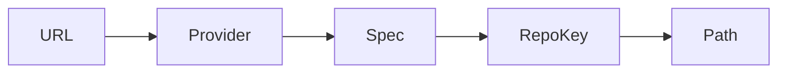

# Repository Specification (repospec)

This document describes the repository specification format, provider support, and storage path conventions.

## Overview

`repospec` is a core package that normalizes various repository URL formats into a canonical form. It provides:
- Provider detection (GitHub, GitLab, Bitbucket, Custom)
- URL parsing and normalization
- Repository key (RepoKey) generation
- Slug generation for path components

## Data Structures

### ProviderType

```go
type ProviderType string

const (
    ProviderGitHub    ProviderType = "github"
    ProviderGitLab    ProviderType = "gitlab"
    ProviderBitbucket ProviderType = "bitbucket"
    ProviderCustom    ProviderType = "custom"
)
```

### EndPoint

Represents the server-side endpoint information (system side: nginx, SSH connection).

```go
type EndPoint struct {
    Host     string       // github.com, gitlab.com, self-hosted.example.com
    Port     string       // :22, :8080 (optional)
    BasePath string       // nginx reverse proxy path (only for HTTPS)
}
```

### Registry

Represents the repository identification under the git server (GitHub/GitLab/Bitbucket).

```go
type Registry struct {
    Provider  ProviderType  // Auto-detected or manually specified
    Group     string       // Primary group/owner (e.g., org)
    SubGroups []string     // Subgroups under group (optional, e.g., [subgroup1, subgroup2])
}

type Repository struct {
    Repo string  // Repository name (e.g., myapp)
}
```

### Spec

The complete specification combining endpoint and registry/repository.

```go
type Spec struct {
    EndPoint
    Registry
    Repository
    RepoKey string  // Canonical identifier
    IsSSH   bool    // Whether original URL was SSH format
}
```

## Supported URL Formats

| Format | Example | Parsed Result |
|--------|---------|---------------|
| SSH | `git@github.com:owner/repo.git` | Provider=github, Host=github.com, Group=owner, Repo=repo |
| HTTPS | `https://github.com/owner/repo.git` | Provider=github, Host=github.com, Group=owner, Repo=repo |
| SSH with port | `ssh://git@gitlab.com:2222/team/sub/repo.git` | Provider=gitlab, Host=gitlab.com, Port=2222, Group=team, SubGroups=[sub], Repo=repo |
| GitLab nested | `git@gitlab.com:team/sub/repo.git` | Provider=gitlab, Host=gitlab.com, Group=team, SubGroups=[sub], Repo=repo |
| Bitbucket | `git@bitbucket.org:workspace/repo.git` | Provider=bitbucket, Host=bitbucket.org, Group=workspace, Repo=repo |
| Self-hosted | `git@git.example.com:org/repo.git` | Provider=custom, Host=git.example.com, Group=org, Repo=repo |
| Self-hosted with basepath | `https://git.example.com/git/org/repo.git` | Provider=custom, Host=git.example.com, BasePath=/git, Group=org, Repo=repo |

## URL Routing: HTTPS vs SSH

```
HTTPS: https://git.example.com/git/owner/repo
       └────BasePath────┘ └─git server─┘
       nginx strips BasePath before forwarding

SSH: git@git.example.com:owner/repo
     └──── via SSH protocol ────┘
     (BasePath not used)
```

## Provider Detection

### Auto-detection Rules

| Host Pattern | Detected Provider |
|--------------|------------------|
| `*.github.com` | github |
| `*.gitlab.com` | gitlab |
| `*.bitbucket.org` | bitbucket |
| **Others** | custom (manual specification required) |

### Manual Specification

For self-hosted instances, users must specify the provider:

```go
NormalizeWithProvider(input string, provider ProviderType) (Spec, error)
```

## Slug Generation

To flatten deep paths into 2-level directory structure, path components are slugified.

### Rules

1. All path components are joined with `-`
2. Single `-` in original name becomes `--` to avoid collision

### Examples

| Original Path | Slug |
|---------------|------|
| `[owner, repo]` | `owner-repo` |
| `[group, subgroup, repo]` | `group-subgroup-repo` |
| `[my-group, my-subgroup, repo]` | `my-group--my-subgroup-repo` |
| `[org-name, 123-repo, app]` | `org-name--123-repo-app` |

## Storage Path Convention

Bare repositories are stored in a 2-level hierarchy:

```
<bareRoot>/<Level1>/<Level2>.git

Level1 = <Host>/<Owner>           # e.g., github.com/owner
Level2 = <Slug(Path)>             # e.g., group-subgroup-repo
```

Where `<bareRoot>` = `<GION_ROOT>/bare`

### Directory Structure Diagram

```
~/.gion/
└── bare/
    ├── github.com/
    │   ├── owner/
    │   │   ├── owner-repo.git/
    │   │   └── owner-other-repo.git/
    │   └── other-owner/
    │       └── other-owner-repo.git/
    ├── gitlab.com/
    │   ├── group/
    │   │   ├── group-subgroup-app.git/
    │   │   └── group-app.git/
    │   └── subgroup-group/
    │       └── subgroup-group-nested-repo.git/
    └── self-hosted.example.com/
        └── org/
            └── org-app.git/
```

### Examples

| RepoKey | Storage Path |
|---------|-------------|
| `github.com/owner/repo` | `<bareRoot>/github.com/owner/repo.git` |
| `gitlab.com/group/sub-repo` | `<bareRoot>/gitlab.com/group/group-sub-repo.git` |
| `custom/self-hosted.io/org/app` | `<bareRoot>/self-hosted.io/org/app.git` |

## RepoKey Format

The canonical identifier for a repository:

```
RepoKey = <Host>[:<Port>][/<BasePath>]/<Group>[/<SubGroups>]/<Repo>

Examples:
- github.com/owner/repo
- gitlab.com/group/sub-repo
- custom/self-hosted.io/org/app
```

**Note**: The `.git` suffix is optional. Both formats are accepted:
- `github.com/owner/repo` (preferred)
- `github.com/owner/repo.git` (legacy, for compatibility)

## Data Flow



## API Reference

### Normalize

```go
func Normalize(input string) (Spec, error)
```

Parses a repository URL and returns a normalized Spec.

### NormalizeWithBasePath

```go
func NormalizeWithBasePath(input string, basePath string) (Spec, error)
```

Same as Normalize, but with manually specified basePath for HTTPS via nginx.

### Slugify

```go
func Slugify(parts []string) string
```

Converts path components to slug format (joins with `-`, single `-` becomes `--`).

### Unslugify

```go
func Unslugify(slug string) []string
```

Converts slug back to path components.

### DetectProvider

```go
func DetectProvider(host string) ProviderType
```

Auto-detects provider from host.

### SpecFromKey

```go
func SpecFromKey(repoKey string) string
```

Converts RepoKey back to display URL (SSH format).

### DisplaySpec

```go
func DisplaySpec(input string) string
```

Returns display-friendly URL for a repository (SSH format).

### DisplayName

```go
func DisplayName(input string) string
```

Returns just the repository name from a URL.

## Migration from v1

### Old Format

```
<bareRoot>/<Host>/<Owner>/<Repo>.git
Example: ~/.gion/bare/github.com/owner/repo.git
```

### New Format

```
<bareRoot>/<Host>/<Owner>/<Slug>.git
Example: ~/.gion/bare/github.com/owner/owner-repo.git
```

### Migration Steps

1. Rename existing bare repository directories
2. Update manifest entries (if stored externally)

## Related Documents

- [INVENTORY.md](./INVENTORY.md) - Workspace inventory format
- [DIRECTORY_LAYOUT.md](./DIRECTORY_LAYOUT.md) - Directory structure
- [ARCHITECTURE.md](./ARCHITECTURE.md) - Application architecture
